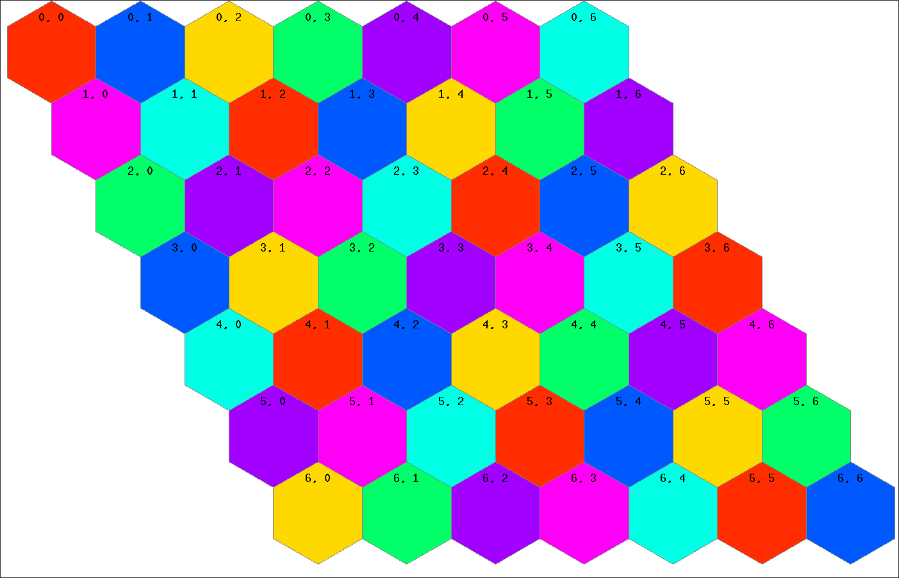

# Dynamic Channel Allocation in cellular networks

This project implements a large variety of strategies for doing channel
allocation in cellular networks. In cellular networks, each base station
must choose (from a limited set) which radio channel to use for each service request.
A channel cannot be in simultanous use at two nearby base stations without causing
interference. If a mobile caller requests service from a base station but there
are no channels that can be used without interference,
then the request must be blocked.
The objective of the channel allocation policy (henceforth "agent", i.e. the decision maker)
is to minimize the probability of blocking calls.

Highlights include ...
- A state-value network with a novel loss function that provides state-of-the-art results.
- Demonstrations of several techniques for which example code does not exist at the time of writing, e.g.
Zap-Q, TDC, TDC for non-linear networks, and Boltzmann-Gumbel exploration.
- Depth-wise separable, locally connected convolutional networks.
- A tree-search like approach for reassigning channels on call hand-off.
- A incremental algorithm for calculating the feature representation of the grid,
which reduces the computational complexity from
`O(NK)` to constant time `O(1)` given `N` grid cells and `K` channels.

The cellular network simulator, along with the best-performing agent, has been ported to both
[Rust](https://github.com/tsoernes/rustdca) and
[Haskell](https://github.com/tsoernes/haskelldca).

## Example usage

The agent presented in
[Torstein Sørnes 2018: Contributions to centralized dynamic channel allocation agents](https://ntnuopen.ntnu.no/ntnu-xmlui/handle/11250/2562774) ([PDF](https://ntnuopen.ntnu.no/ntnu-xmlui/bitstream/handle/11250/2562774/19523_FULLTEXT.pdf?sequence=1)), 
provides state-of-the-art results for cellular networks with a centralized agent.
It uses TDC gradients with a state-value linear neural network with differential returns
(i.e. optimizing for average reward) and hand-off look-ahead (HLA).
To run it, with 10 Erlangs worth of call traffic and 15% chance of hand-off:

`python3 main.py tftdcsinghnet --hoff_lookahead --erlangs 10 --p_handoff 0.15`

In general:

`python3 main.py <agent_name> --long_option_name -short_option_name`

To see the options used for the plots in the thesis above, see [plotscript.sh](dca/plotscript.sh).

Listed below are some of the features and agent implementations.
Run `python3 main.py --help` for a comprehensive list and default options.

## Non-learning agents
See [fixedstrats.py](dca/strats/fixedstrats.py) for implementation.

- Fixed Assign (Agent name: `fixedassign`)
- Random Assign (`randomassign`)
- Fixed channel preference, random if none available (`fixedrandomassign`)

## RL agents
The RL agent offer a large amount of options, covering 20+ papers in
the RL and channel allocation domain, offering a choice of:
- Reward definition
- Targets (i.e. what we want to maximize or minimize in the domain)
- Loss functions (of which in RL there are several of given fixed reward and target definition),
- Exploration strategies
- State- and state-action methods
- Neural network architecture (convolutional neural networks, dueling Q-networks, +++)

### Features and implementations
Target types:
- MDP Average reward (parameterized by average reward learning rate) (e.g. `-target avg -wbeta 0.01`)
(see e.g. Tadepalli 2017: Average-Reward Learning Reinforcement)
- MDP Discounted reward (e.g. `-target discount --gamma 0.8`)
- SMDP Discounted reward (e.g. `-target discount -bdisc --beta 40 -rtype smdp_callcount`)
(see e.g. [Gosavi 2017: A tutorial for Reinforcement Learning](https://web.mst.edu/~gosavia/tutorial.pdf)
or Bradtke et al. 1996: Reinforcement Learning Methods for Continuous-Time Markov Decision Problems)
- RSMART (`-target avg_rsmart`)

Reward types:
- (+1) on accepted calls and (-1) on blocked calls (`-rtype new_block`)
- Call count (`-rtype callcount`)
- Call count integrated over time (`-rtype smdp_callcount`)

Two step look-ahead on hand-offs (`-hla`)

Exploration strategies (`exp_policies.py`):
- Greedy (`-epol greedy`)
- Epsilon-greedy (e.g. `-epol eps_greedy -eps 0.5`)
- Boltzmann (e.g. `-epol boltzmann -eps 2`)
- Boltzmann-Gumbel (`-epol bgumbel`)
(see [Cesa-Bianchi 2017 et.al: Boltzmann Exploration Done Right](https://arxiv.org/abs/1705.10257))
- Fixed nominal channel preference (`-epol nom_fixed_greedy`)
- Greedy nominal channel preference (`-epol nom_greedy`)
- Boltzmann with nominal channel preference (`-epol nom_boltzmann`)

### State value approaches
All neural networks use the same approach as in
Singh and Bertsekas 1997: Reinforcement Learning for Dynamic Channel Allocation in Cellular Telephone Systems,
where the input to the neural network is not the grid but a feature representation of it.

State value networks have a single scalar output - the value of the input state - contrary to
state-action networks which output a value for each action. The former approach is always
more data-efficient due to fewer neural-network weights, however it is not always realizable because
knowledge of the reward function and (partial knowledge of) the state transition function is necessary
if we want to select actions using the network.
In this domain, the approach is feasible because rewards and grid-transition being deterministic
given the current grid and event.

Loss functions:
- True Online TD Lambda (`tdlsinghnet`, `singh_tdl.py`)
- GTD2 (`gtd2singhnet`, [singh_gtd2.py](dca/nets/singh_gtd2.py))
- TDC - TD0 with Gradient correction
(`tdcsinghnet` for [singh_tdc.py](dca/nets/singh_tdc.py), or
`tftdcsinghnet` for [singh_tdc_tf.py](dca/nets/singh_tdc_tf.py)
which is an equivalent version implemented in all TensorFlow)
(see Sutton et al. 2009:
Fast Gradient-Descent Methods for Temporal-Difference Learning with Linear Function Approximation)
- TDC-NL - TD0 with Gradient correction for non-linear function approximation, i.e.
multi-layers neural networks ([singh_tdc_nl.py](dca/nets/singh_tdc_nl.py))
(see Maei et al. 2009: Convergent Temporal-Difference Learning with Arbitrary Smooth Function Approximation)
- Naive Residual Gradients - ([singh_resid.py](dca/nets/singh_resid.py))
(see Baird 1995: Residual Algorithms: Reinforcement Learning with Function Approximation)
- LSTD - Least Squares Temporal Difference (`singh_lstd.py`)

Feature representations (see `gridfuncs_numba.py`):
- As in Singh97 (`-ftype vanilla`)
- As in Singh97, but also include number of used channels with dist 3 or less (`-ftype big`)
- Separate features for number of used chs with dist 4, with dist 3, .. (`-ftype big2`)

### State-Action Value Nets
RL Methods:
- Q-Learning (`qlearnnet`)
- SARSA (`sarsanet`)
- Update towards max _eligible_ action (`qlearneligiblenet`)

Options:
- Use n\_channels X n\_cells neural network outputs (`--bighead`) instead of default where cell is input to network and output is of size n\_channels_
- Dueling Q-Net (`-duel`)
(see Wang et al. 2016: Dueling Network Architectures for Deep Reinforcement Learning)
- Double Q-Net (e.g. `--net_copy_iter 50 --net_creep_tau 0.1`)
(see Hasselt et al. 2016: Deep Reinforcement Learning with Double Q-Learning)
- Experience replay (e.g. `--batch_size 10 --buffer_size 5000`)
(see Mnih et al. 2015: Human-level control through deep reinforcement learning)

Other:
- N-step returns (e.g. `nqlearnnet --n_step 4`)
- GAE (Generalized Advantage Estimator) returns (`gaeqlearnnet`)
- Feature representation as network input (raw grid is default) (`--qnet_freps` or `--qnet_freps_only`)
- ++

### State-Action Table Lookup
See [table_rl.py](dca/strats/table_tl.py) for implementation
- Lilith SARSA (`sarsa`) (see e.g. Lilith et al. 2004:
Reduced-State SARSA with Channel Reassignment for Dynamic Channel Allocation in Cellular Mobile)
- Lilith Table-Trimmed SARSA (`tt_sarsa`)
- Lilith Reduced-State SARSA (`rs_sarsa`)
- All of the above, with lambda returns (e.g. `rs_sarsa --lambda 0.8`)
- Zap-Q learning with RS-SARSA feature rep. (`zapq`) (Warning: __Very_ SLOW!)

## Misc
Extensive scaffolding for hyperparameter testing using either
Dlib (see [dlib_runner.py](runners/dlib_runner.py))
or Hyperopt (see [hopt_runner.py](runners/hopt_runner.py))
- Parallel optimization processes
- Save and resume optimization results and parameters to file or database (MongoDB, for Hyperopt only)
- Limit GPU usage to N<M of the M simultaneous processes (use CPU only for remaining M-N processes)
- Run N<=M processes with same hyperparameters, but different random seeds and take the average of the results, with a total of M concurrent processes (reduces maximization bias inherent when doing hyperparameter
optimization of a stochastic process)

Average over multiple runs (e.g. `python3 rs_sarsa --avg_runs 8`, see `runners/avg_runner.py`)

Exploration comparisons (`e.g. python3 rs_sarsa --exp_policy_cmp N`, see `runners/exp_pol_runner.py`)
- Compare different exploration strategies,
each using a different range of exploration parameters (e.g. epsilon)
- For each exploration strategy and parameter choice,
average over up to N runs if all runs so far have yielded block. prob. less than threshold
(e.g. `--breakout_thresh 0.15`)

# Meta
If you have questions, contributions, or problems, open up a new issue.
